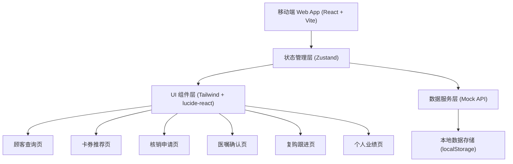
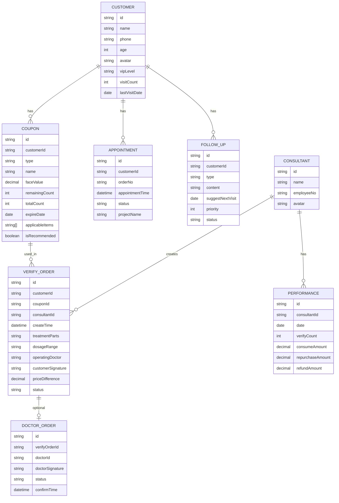

## 1. 架构设计



## 2. 技术说明

- 前端：React@18 + TypeScript + Vite@5
- 状态管理：Zustand@4
- 样式：TailwindCSS@3
- 图标：lucide-react@0.344
- 图表：recharts@2.12
- 路由：react-router-dom@6
- 后端：纯前端 Mock 数据，无后端服务
- 数据持久化：localStorage

## 3. 路由定义

| 路由 | 页面 | 说明 |
|------|------|------|
| / | 顾客查询页 | 首页，默认展示今日到院列表和搜索入口 |
| /coupons/:customerId | 卡券推荐页 | 展示指定顾客的所有卡券及推荐 |
| /verify/:customerId | 核销申请页 | 发起核销流程，补充治疗信息 |
| /orders | 医嘱确认页 | 待医生确认的核销单列表 |
| /follow-up | 复购跟进页 | 待跟进顾客、复诊建议、退款风险 |
| /performance | 个人业绩页 | 业绩概览、趋势图表、明细列表 |

## 4. 数据模型

### 4.1 数据模型定义



### 4.2 核心类型定义

```typescript
type CouponType = 'project_card' | 'activity_coupon' | 'birthday_coupon' | 'treatment_course';
type VerifyStatus = 'pending_doctor' | 'success' | 'failed' | 'cancelled';
type FollowUpType = 'no_verify' | 'repurchase' | 'refund_risk' | 'return_visit';

interface Customer {
  id: string;
  name: string;
  phone: string;
  age: number;
  avatar: string;
  vipLevel: '普通' | '银卡' | '金卡' | '钻石';
  visitCount: number;
  lastVisitDate: string;
}

interface Coupon {
  id: string;
  customerId: string;
  type: CouponType;
  name: string;
  faceValue: number;
  remainingCount: number;
  totalCount: number;
  expireDate: string;
  applicableItems: string[];
  isRecommended: boolean;
}

interface VerifyOrder {
  id: string;
  customerId: string;
  couponId: string;
  consultantId: string;
  createTime: string;
  treatmentParts: string[];
  dosageRange: string;
  operatingDoctor: string;
  customerSignature: string;
  priceDifference: number;
  originalProject?: string;
  upgradedProject?: string;
  status: VerifyStatus;
  needDoctorConfirm: boolean;
}

interface FollowUpItem {
  id: string;
  customerId: string;
  customerName: string;
  customerAvatar: string;
  type: FollowUpType;
  title: string;
  content: string;
  suggestNextVisit?: string;
  priority: 1 | 2 | 3;
  status: 'pending' | 'processing' | 'done';
  createdAt: string;
  stayDuration?: string;
  consultedProject?: string;
  historicalConsumption?: number;
  refundAmount?: number;
}

interface DailyPerformance {
  date: string;
  verifyCount: number;
  consumeAmount: number;
}
```
