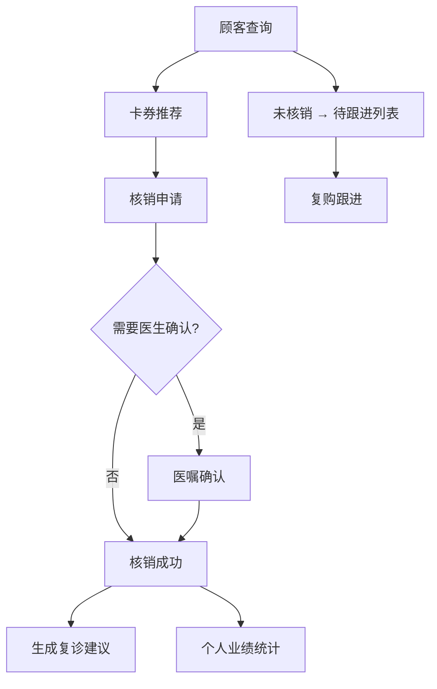

## 1. 产品概述

医美咨询师移动核销助手，服务于在面诊室、治疗区来回跟进顾客的医美机构咨询师，核心场景是边与顾客沟通边快速完成卡券使用确认，提升核销效率与顾客体验。

- 目标用户：医美机构现场咨询师
- 核心价值：移动端便捷核销、智能卡券推荐、医嘱确认闭环、业绩实时追踪

## 2. 核心功能

### 2.1 用户角色

| 角色 | 登录方式 | 核心权限 |
|------|----------|----------|
| 咨询师 | 工号+密码/手机号验证码 | 顾客查询、卡券核销、医嘱确认、复购跟进、业绩查看 |

### 2.2 功能模块

1. **顾客查询页**：搜索栏（手机号/姓名/预约单）、今日到院列表、搜索结果、顾客详情入口
2. **卡券推荐页**：顾客项目卡/活动券/生日券/剩余疗程展示、智能推荐标签、核销入口
3. **核销申请页**：券选择、治疗部位/剂量/医生/签字补充、差价记录、医嘱确认发起、核销提交
4. **医嘱确认页**：待确认医嘱列表、医生签字、确认/驳回操作、确认后状态同步
5. **复购跟进页**：待跟进列表（到院未核销）、复诊建议自动生成、复购提醒、退款风险提示
6. **个人业绩页**：当月核销量、消耗金额、复购数据、退款风险预警、趋势图表

### 2.3 页面详情

| 页面名称 | 模块名称 | 功能描述 |
|----------|----------|----------|
| 顾客查询页 | 搜索区 | 支持手机号、姓名、预约单号多条件模糊搜索，实时匹配 |
| 顾客查询页 | 今日到院列表 | 展示当天已签到顾客，按预约时间排序，点击进入详情 |
| 顾客查询页 | 顾客卡片 | 展示头像、姓名、年龄、到院次数、VIP等级、最近到院时间 |
| 卡券推荐页 | 卡券分类标签 | 项目卡/活动券/生日券/剩余疗程 Tab 切换 |
| 卡券推荐页 | 智能推荐卡片 | 标注「推荐优先使用」，展示券有效期、剩余次数、适用项目 |
| 卡券推荐页 | 核销按钮 | 底部悬浮「发起核销」按钮，多选模式 |
| 核销申请页 | 券信息确认 | 展示选中卡券的名称、面额、剩余次数、适用范围 |
| 核销申请页 | 治疗信息补充 | 治疗部位（多选标签）、剂量区间（滑块/输入）、操作医生（下拉选择） |
| 核销申请页 | 顾客签字 | Canvas 手写签字区域，支持清空、重签 |
| 核销申请页 | 补差价记录 | 项目升级时记录原项目、新项目、差额金额、支付方式 |
| 核销申请页 | 医嘱确认开关 | 注射/光电项目自动触发医生确认开关，开启后进入确认流程 |
| 医嘱确认页 | 待确认列表 | 按时间倒序展示待医生确认的核销单，显示顾客、项目、申请时间 |
| 医嘱确认页 | 确认详情 | 展示核销信息、治疗部位、剂量、咨询师签字，医生签字确认 |
| 复购跟进页 | 待跟进列表 | 到院未核销顾客列表，标注停留时长、咨询项目、跟进状态 |
| 复购跟进页 | 复诊建议 | 核销成功后自动生成下次复诊时间、提醒内容、建议项目 |
| 复购跟进页 | 复购提醒卡片 | 展示高意向顾客、历史消费记录、推荐复购项目 |
| 复购跟进页 | 退款风险提示 | 红色预警卡片，标注退款原因、金额、处理优先级 |
| 个人业绩页 | 数据概览 | 当月核销量、消耗金额、复购率、客单价数字卡片 |
| 个人业绩页 | 趋势图表 | 近30天核销金额折线图、项目消耗占比饼图 |
| 个人业绩页 | 业绩明细 | 按日/周/月筛选，展示每笔核销记录详情 |

## 3. 核心流程

咨询师通过搜索或今日到院列表找到顾客 → 查看顾客名下所有卡券，系统智能推荐优先消耗券 → 选择券并发起核销 → 补充治疗部位、剂量、操作医生信息，顾客手写签字 → 如需医生确认（注射/光电项目）则发起医嘱确认 → 医生确认后核销成功，自动生成下次复诊建议 → 未核销顾客进入待跟进列表，咨询师可进行复购跟进 → 所有核销数据实时同步至个人业绩中心。

## 4. 用户界面设计

### 4.1 设计风格

- **主色调**：医疗粉紫渐变 `#A78BFA → #F472B6`，传达医美行业的专业与柔和感
- **辅助色**：成功绿 `#10B981`、预警橙 `#F59E0B`、风险红 `#EF4444`
- **中性色**：深灰 `#1F2937`、中灰 `#6B7280`、浅灰 `#F9FAFB`、纯白 `#FFFFFF`
- **按钮风格**：大圆角 16px，粉紫渐变主按钮，卡片阴影 `shadow-lg`
- **字体**：`PingFang SC` + `Noto Sans SC`，标题 18px 粗体、正文 14px 常规、辅助 12px 浅色
- **布局风格**：移动端优先、卡片式布局、底部 5 Tab 导航、顶部搜索栏
- **图标**：lucide-react 线性图标，统一 20px 尺寸

### 4.2 页面设计概览

| 页面名称 | 模块名称 | UI 元素 |
|----------|----------|---------|
| 顾客查询页 | 顶部搜索 | 圆角搜索框、搜索图标、清除按钮、占位提示文字 |
| 顾客查询页 | 顾客卡片 | 头像圆形、姓名VIP标签、到院次数徽章、渐入动画 |
| 卡券推荐页 | 卡券卡片 | 左色条区分类型、推荐角标、剩余进度条、悬浮上移动效 |
| 核销申请页 | 表单区域 | 标签组多选、分段选择器、滑块、签字板、渐显表单 |
| 医嘱确认页 | 待办卡片 | 状态标签、时间轴、医生签名字段、确认动效 |
| 复购跟进页 | 风险卡片 | 红色边框、预警图标、优先级徽章、脉冲提醒动画 |
| 个人业绩页 | 数字卡片 | 渐变背景、数字放大动画、趋势箭头、色块区分 |
| 个人业绩页 | 图表区 | 折线图带动画、饼图渐变配色、悬浮 tooltip |

### 4.3 响应式

移动端优先设计，宽度 375px-430px 为主要适配区间。内容区最大宽度 480px 居中展示。所有交互区域高度 ≥ 44px 以保证触控友好。手势支持：左滑删除跟进项、下拉刷新列表。
